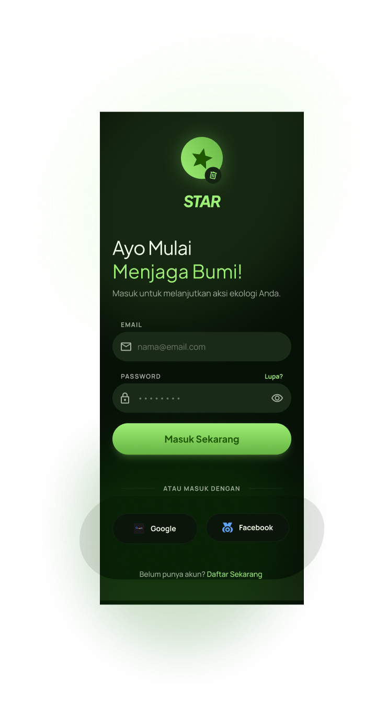

# STAR — Smart Trash Assistant Report

<p align="center">
  
</p>

<p align="center">
  
  
  
  
  
</p>

> Aplikasi Android berbasis AI untuk mendeteksi jenis sampah melalui kamera, memberikan informasi pengelolaan sampah, dan mengirimkan notifikasi kepada petugas kebersihan terdekat.

---

## Daftar Isi

- [Tentang Aplikasi](#tentang-aplikasi)
- [Fitur Utama](#fitur-utama)
- [Tampilan UI](#tampilan-ui)
- [Teknologi yang Digunakan](#teknologi-yang-digunakan)
- [Cara Instalasi](#cara-instalasi)
- [Struktur Project](#struktur-project)
- [Tim Pengembang](#tim-pengembang)
- [SCRUM Board](#scrum-board)

---

## Tentang Aplikasi

**STAR (Smart Trash Assistant Report)** adalah aplikasi Android yang membantu masyarakat dan petugas kebersihan dalam mengelola sampah secara lebih cerdas. Dengan memanfaatkan teknologi AI (Google Gemini Vision), pengguna dapat melakukan scan sampah menggunakan kamera smartphone untuk mengetahui jenis, kategori, dan cara pengelolaan sampah yang tepat.

Selain itu, STAR menyediakan fitur pelaporan sampah berlebih yang secara otomatis mengirimkan notifikasi kepada petugas kebersihan terdekat, sehingga penanganan sampah menjadi lebih cepat dan efisien.

---

## Fitur Utama

| Fitur | Deskripsi | Status |
|---|---|---|
| Scan Sampah | Deteksi jenis sampah via kamera menggunakan AI | 🚧 Dalam Pengembangan |
| Klasifikasi Sampah | Informasi detail: organik, anorganik, B3, daur ulang | 🚧 Dalam Pengembangan |
| Notifikasi Petugas | Kirim laporan ke petugas kebersihan terdekat | 🚧 Dalam Pengembangan |
| Login & Register | Autentikasi user via Firebase Auth | ✅ Selesai |
| Dashboard | Halaman utama dengan menu navigasi | ✅ Selesai |
| Profil User | Data dan riwayat laporan pengguna | 🚧 Dalam Pengembangan |

---

## Tampilan UI

### 1. Splash Screen
> Halaman pembuka aplikasi dengan logo STAR

<p align="center">
  
</p>

---

### 2. Login & Register
> Halaman autentikasi pengguna menggunakan Firebase Authentication

<p align="center">
  
  &nbsp;&nbsp;&nbsp;
  
</p>

---

### 3. Home / Dashboard
> Halaman utama dengan menu fitur-fitur aplikasi STAR

<p align="center">
  
</p>

---

### 4. Scan Sampah
> Fitur kamera AI untuk mendeteksi dan mengklasifikasi jenis sampah

<p align="center">
  
  &nbsp;&nbsp;&nbsp;
  
</p>

---

### 5. Notifikasi Petugas
> Kirim laporan sampah membludak ke petugas kebersihan terdekat

<p align="center">
  
</p>

---

### 6. Profil User
> Halaman profil dan riwayat laporan pengguna

<p align="center">
  
</p>

---

## Teknologi yang Digunakan

| Teknologi | Kegunaan |
|---|---|
| Android Studio | IDE pengembangan aplikasi |
| Java | Bahasa pemrograman utama |
| Firebase Authentication | Login & Register pengguna |
| Firebase Firestore | Database laporan & data user |
| Firebase Cloud Messaging (FCM) | Push notifikasi ke petugas |
| Google Gemini Vision API | Deteksi & klasifikasi sampah via AI |
| CameraX | Akses kamera untuk scan sampah |

---

## Cara Instalasi

### Prasyarat
- Android Studio Hedgehog (2023.1.1) atau lebih baru
- JDK 17+
- Android SDK 24+ (minimal Android 7.0)
- Akun Firebase (untuk `google-services.json`)
- API Key Google Gemini

### Langkah Instalasi

1. **Clone repository ini**
   ```bash
   git clone https://github.com/USERNAME_KAMU/STAR-Smart-Trash-Assistant-Report.git
   ```

2. **Buka di Android Studio**
   ```
   File → Open → pilih folder hasil clone
   ```

3. **Tambahkan `google-services.json`**
   - Buka [Firebase Console](https://console.firebase.google.com)
   - Download `google-services.json` dari project kamu
   - Letakkan di folder `app/`

4. **Tambahkan API Key Gemini**
   - Buka file `local.properties`
   - Tambahkan baris berikut:
   ```
   GEMINI_API_KEY=your_api_key_here
   ```

5. **Sync Gradle & jalankan aplikasi**
   ```
   Build → Make Project (Ctrl+F9)
   Run → Run 'app' (Shift+F10)
   ```

---

## Struktur Project

```
STAR-App/
├── app/
│   ├── src/
│   │   └── main/
│   │       ├── java/com/star/app/
│   │       │   ├── activity/
│   │       │   │   ├── SplashActivity.java
│   │       │   │   ├── LoginActivity.java
│   │       │   │   ├── RegisterActivity.java
│   │       │   │   ├── HomeActivity.java
│   │       │   │   ├── ScanActivity.java
│   │       │   │   ├── NotifikasiActivity.java
│   │       │   │   └── ProfilActivity.java
│   │       │   ├── model/
│   │       │   │   ├── User.java
│   │       │   │   └── LaporanSampah.java
│   │       │   └── utils/
│   │       │       ├── FirebaseHelper.java
│   │       │       └── GeminiHelper.java
│   │       └── res/
│   │           ├── layout/
│   │           ├── drawable/
│   │           └── values/
│   └── build.gradle
├── docs/
│   └── images/          ← screenshot UI disimpan di sini
├── .gitignore
├── build.gradle
└── README.md
```

---

## Tim Pengembang

| Nama | NIM | Role |
|---|---|---|
| [Nama Kamu] | [NIM Kamu] | Android Developer |
| [Nama Anggota 2] | [NIM] | UI/UX Designer |
| [Nama Anggota 3] | [NIM] | Backend / Firebase |

> *Ganti dengan data tim kamu yang sebenarnya*

---

## SCRUM Board

Manajemen project menggunakan metode SCRUM melalui ClickUp.

**Link ClickUp:** [Klik di sini untuk melihat SCRUM Board STAR App](https://app.clickup.com/LINK_CLICKUP_KAMU)

### Sprint Overview

| Sprint | Fokus | Status |
|---|---|---|
| Sprint 1 | Setup project, Splash, Login, Register | ✅ Selesai |
| Sprint 2 | Home Dashboard, navigasi antar screen | ✅ Selesai |
| Sprint 3 | Fitur Scan Sampah + Gemini API | 🚧 Dalam Pengembangan |
| Sprint 4 | Notifikasi Petugas + FCM | 📅 Planned |
| Sprint 5 | Profil User, testing, bug fix | 📅 Planned |

---

## Lisensi

Project ini dibuat untuk keperluan tugas akademik.  
© 2025 — Universitas Pelita Bangsa

---

<p align="center">Made with ❤️ by 312410425 — Universitas Pelita Bangsa</p>
