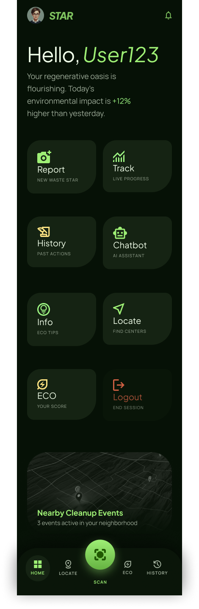
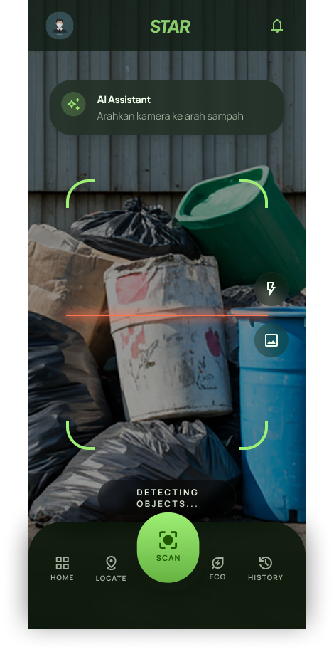
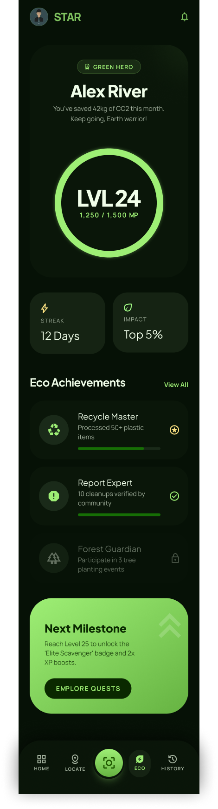

# STAR — Smart Trash Assistant Report

<p align="center">
  
</p>

<p align="center">
  
  
  
  
  
  
  
</p>

> Aplikasi Android yang membantu pengguna mengenali jenis sampah secara real-time lewat kamera, melaporkan insiden sampah dengan lokasi GPS, memantau riwayat & pencapaian lingkungan, serta berdiskusi dengan asisten AI seputar pengelolaan sampah — semuanya berjalan on-device tanpa biaya layanan cloud berbayar.

---

## Daftar Isi

- [Tentang Aplikasi](#tentang-aplikasi)
- [Fitur Utama](#fitur-utama)
- [Tampilan UI](#tampilan-ui)
- [Teknologi yang Digunakan](#teknologi-yang-digunakan)
- [Cara Instalasi](#cara-instalasi)
- [Struktur Project](#struktur-project)
- [Catatan & Keterbatasan](#catatan--keterbatasan)
- [Tim Pengembang](#tim-pengembang)
- [SCRUM Board](#scrum-board)
- [Lisensi](#lisensi)

---

## Tentang Aplikasi

**STAR (Smart Trash Assistant Report)** adalah aplikasi Android yang menggabungkan computer vision on-device, gamifikasi, peta interaktif, dan chatbot AI untuk mendorong perilaku pengelolaan sampah yang lebih baik.

Pengguna dapat mengarahkan kamera ke sebuah objek dan aplikasi akan otomatis mengenali jenis objeknya lalu mengklasifikasikannya sebagai sampah **Organik** atau **Anorganik**, sambil memberi **Eco Points** sebagai bentuk gamifikasi. Pengguna juga bisa **melaporkan insiden sampah** (penumpukan, pembuangan ilegal, dll) lengkap dengan foto dan titik lokasi GPS, yang kemudian muncul di **peta interaktif** sehingga siapa pun (termasuk petugas kebersihan) bisa melihat dan menavigasi langsung ke lokasi tersebut.

Semua data riwayat (scan & laporan) tersimpan **secara lokal di perangkat**, dan pengguna bisa memantau perkembangan level, streak harian, serta pencapaian (achievement) mereka di halaman Eco Profile. Untuk pertanyaan seputar sampah dan lingkungan, tersedia chatbot **Oasis** yang ditenagai model AI gratis.

---

## Fitur Utama

| Fitur | Deskripsi | Status |
|---|---|---|
| **Scan Sampah** | Deteksi objek real-time via kamera (Camera2 + TensorFlow Lite/MobileNetV2), diklasifikasikan Organik/Anorganik | ✅ Selesai |
| **Eco Points & Gamifikasi** | Tiap scan menghasilkan poin + nama material & "proses daur ulang" (mis. *Plastic Bottle → PET Cycle*) | ✅ Selesai |
| **Report Insiden** | Lapor sampah ilegal/menumpuk: foto, kategori, lokasi GPS (atau alamat manual), deskripsi | ✅ Selesai |
| **Locate (Peta Laporan)** | Lihat seluruh lokasi laporan di peta interaktif, tap marker untuk detail, navigasi langsung via app Maps | ✅ Selesai |
| **Riwayat (History)** | Gabungan riwayat scan & laporan dalam satu feed, dikelompokkan per tanggal, ada bonus streak mingguan | ✅ Selesai |
| **Eco Profile** | Level & XP dari akumulasi poin, progress achievement, estimasi CO2 yang terhindar bulan ini | ✅ Selesai |
| **Chatbot "Oasis"** | Asisten AI yang fokus menjawab seputar sampah & lingkungan, dengan konteks percakapan | ✅ Selesai |
| **Info & Edukasi** | Artikel tips lingkungan dengan filter kategori, pencarian, bookmark, dan share native | ✅ Selesai |
| **Login & Dashboard** | Halaman masuk + menu utama (bento grid) ke seluruh fitur | ✅ Selesai |

---

## Tampilan UI

> Tempel screenshot kamu di folder `docs/images/` dengan nama file sesuai di bawah ini.

| Halaman | File |
|---|---|
| Login | `docs/images/login.png` |
| Home / Dashboard | `docs/images/dashboard.png` |
| Scan Sampah | `docs/images/scan.png` |
| Report Insiden | `docs/images/report.png` |
| Locate (Peta) | `docs/images/locate.png` |
| History | `docs/images/history.png` |
| Eco Profile | `docs/images/eco.png` |
| Chatbot Oasis | `docs/images/chatbot.png` |
| Info & Artikel | `docs/images/info.png` |

<p align="center">
  
  &nbsp;&nbsp;
  
  &nbsp;&nbsp;
  
</p>

---

## Teknologi yang Digunakan

| Teknologi | Kegunaan |
|---|---|
| **Android Studio + Java** | IDE & bahasa pemrograman utama |
| **Camera2 API** | Kontrol kamera native untuk preview & capture real-time |
| **TensorFlow Lite (LiteRT)** | Inference model machine learning langsung di perangkat (on-device, offline) |
| **MobileNetV2 (ImageNet)** | Model klasifikasi objek pretrained dari Google (lisensi Apache-2.0), hasilnya dipetakan ke kategori sampah |
| **Room** | Database lokal (SQLite) untuk menyimpan riwayat scan & laporan |
| **Groq API** | Layanan inference LLM gratis (model `llama-3.3-70b-versatile`) untuk chatbot Oasis |
| **OkHttp** | HTTP client untuk komunikasi ke Groq API |
| **osmdroid** | Library peta open-source berbasis OpenStreetMap — gratis, tanpa API key |
| **LocationManager & Geocoder** | API bawaan Android untuk ambil koordinat GPS & ubah jadi alamat (reverse geocoding) |
| **RecyclerView** | Daftar dinamis untuk halaman History & Info |
| **SharedPreferences** | Penyimpanan ringan untuk status bookmark artikel |

---

## Cara Instalasi

### Prasyarat

- Android Studio versi terbaru
- JDK 11
- Android SDK: minSdk 24 (Android 7.0), targetSdk 35, compileSdk 36
- Koneksi internet (untuk sync Gradle pertama kali, download model TFLite ke assets, tile peta osmdroid, dan akses Groq API)
- API Key **Groq** gratis (langkah di bawah — tidak perlu kartu kredit)

### Langkah Instalasi

1. **Clone repository ini**
   ```bash
   git clone https://github.com/mantap70/STAR-Smart-Trash-Assistant-Report.git
   ```

2. **Buka di Android Studio**
   ```
   File → Open → pilih folder hasil clone
   ```

3. **Dapatkan API Key Groq (gratis)**
   - Buka [console.groq.com](https://console.groq.com), daftar/login
   - Masuk ke **API Keys** → **Create API Key**
   - Copy key yang muncul (diawali `gsk_...`)

4. **Tambahkan API Key ke `local.properties`**
   - Buka file `local.properties` di **root project** (sejajar `settings.gradle.kts`, bukan di dalam folder `app/`)
   - Tambahkan baris:
     ```
     GROQ_API_KEY=gsk_xxxxxxxxxxxxxxxxxxxxx
     ```
   - File ini sudah otomatis di-*gitignore*, jadi key tidak akan ikut ter-commit.

5. **Sync Gradle & jalankan**
   ```
   File → Sync Project with Gradle Files
   Run → Run 'app' (Shift+F10)
   ```

> Tidak perlu setup Firebase, Google Cloud, atau API key berbayar apa pun — seluruh fitur AI & peta di app ini menggunakan layanan gratis (TensorFlow Lite berjalan offline, osmdroid tidak butuh API key, Groq punya tier gratis tanpa kartu kredit).

---

## Struktur Project

```
STAR/
├── app/
│   ├── src/main/
│   │   ├── assets/
│   │   │   ├── ImageNetLabels.txt
│   │   │   └── mobilenet_v2_1.0_224.tflite
│   │   ├── java/com/mantao/star/
│   │   │   ├── SplashActivity.java
│   │   │   ├── LoginActivity.java
│   │   │   ├── MainActivity.java
│   │   │   ├── ScanActivity.java          ← Camera2 + klasifikasi real-time
│   │   │   ├── WasteClassifier.java       ← wrapper TensorFlow Lite
│   │   │   ├── EcoPointsMapper.java       ← mapping label → poin & nama material
│   │   │   ├── ReportActivity.java
│   │   │   ├── Report.java / ReportDao.java
│   │   │   ├── ScanHistory.java / ScanHistoryDao.java
│   │   │   ├── AppDatabase.java           ← konfigurasi Room
│   │   │   ├── HistoryActivity.java / HistoryAdapter.java / HistoryItem.java / BonusCard.java
│   │   │   ├── EcoActivity.java / CircularProgressView.java
│   │   │   ├── LocateActivity.java        ← peta osmdroid
│   │   │   ├── ChatbotActivity.java / GroqApiClient.java / ChatMessage.java
│   │   │   └── InfoActivity.java / Article.java / ArticleRepository.java / ArticleAdapter.java / ArticleDetailActivity.java
│   │   ├── res/
│   │   │   ├── layout/
│   │   │   ├── drawable/
│   │   │   ├── font/        (manrope.ttf, plusjakartasans.ttf)
│   │   │   └── values/
│   │   └── AndroidManifest.xml
│   └── build.gradle.kts
├── docs/
│   └── images/              ← simpan screenshot UI di sini
├── local.properties         ← TIDAK di-commit, isi GROQ_API_KEY sendiri
├── .gitignore
├── build.gradle.kts
└── README.md
```

---

## Catatan & Keterbatasan

Beberapa hal yang penting untuk dipahami soal scope project ini saat ini:

- **Data tersimpan lokal di perangkat** (lewat Room) — belum ada sinkronisasi ke server/cloud, jadi riwayat scan & laporan tidak otomatis muncul di device lain milik pengguna yang sama.
- **Model deteksi sampah** menggunakan MobileNetV2, model umum yang dilatih di dataset ImageNet (bukan dataset sampah khusus). Hasil deteksinya dipetakan secara manual ke kategori Organik/Anorganik via *keyword matching* (lihat `EcoPointsMapper.java`), sehingga akurasinya mengikuti kemampuan model umum tersebut.
- **Belum ada notifikasi push otomatis** ke petugas kebersihan. Laporan yang masuk bisa dilihat siapa pun lewat halaman **Locate** (peta), tapi belum ada mekanisme push notification ke pihak tertentu.
- **Login bersifat UI/validasi lokal** — belum terhubung ke sistem autentikasi sungguhan (Firebase Auth atau lainnya).
- **Estimasi CO2** di halaman Eco Profile adalah perkiraan kasar untuk kebutuhan gamifikasi, bukan hasil perhitungan ilmiah yang presisi.
- **Koordinat laporan** hanya tersimpan kalau lokasi diisi lewat tombol GPS — laporan dengan alamat yang diketik manual tidak akan muncul sebagai marker di peta.

---

## Tim Pengembang

| Nama | NIM | Role |
|---|---|---|
| Fathan Atallah Rasya Nugraha | 312410425 | Android Developer |

---

## SCRUM Board

Manajemen project menggunakan metode SCRUM melalui ClickUp.

**Link ClickUp:** [Klik di sini untuk melihat SCRUM Board STAR App](https://app.clickup.com/90181808525/v/li/901816229400)

Rincian sprint dan task detail dikelola langsung di board ClickUp tersebut.

---

## Lisensi

Project ini dibuat untuk keperluan tugas akademik.
© 2025–2026 — Universitas Pelita Bangsa

---

<p align="center">Made with ❤️ by 312410425 — Universitas Pelita Bangsa</p>
